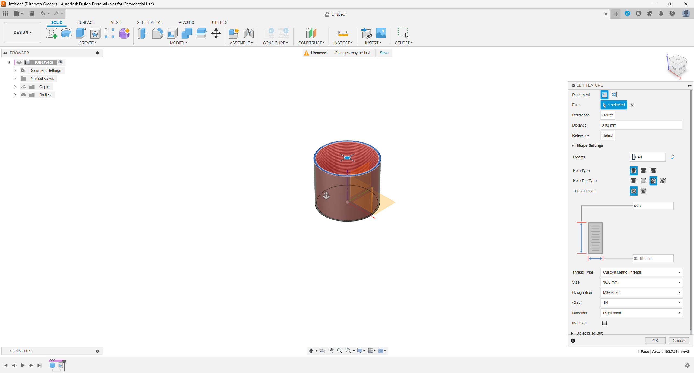

# Custom Threads

## Installation

Copy the custom thread xml file(s) from this Repo to your version of Fusion's ThreadData folder and restart Fusion.

On Windows the threadData folder is
%localappdata%\Autodesk\webdeploy\Production\ [*Version ID*] \Fusion\Server\Fusion\Configuration\ThreadData

To find this folder...

* Turn on viewing hidden files and folders
* * Open %localappdata%\Autodesk\webdeploy\Production\
* * Sort by: "Date-created"
* * Open the most recent versionID folder
* * drill down to Fusion\Server\Fusion\Configuration\ThreadData

Instructions on opening the ThreadData folder can be found here: <https://www.autodesk.com/support/technical/article/caas/sfdcarticles/sfdcarticles/Custom-Threads-in-Fusion-360.html?msockid=15095ba44c5b6175301248d24d0d60ce>

Note: Custom Threads are lost when fusion is upgraded.  The third party "ThreadKeeper" plugin is helpful for automatically copying these from version to version.

## CustomMetricThreads.xml

Contains M36x0.75 threads to fit a telescope.

Thread data from this calculator <https://www.machiningdoctor.com/calculators/threading/>
