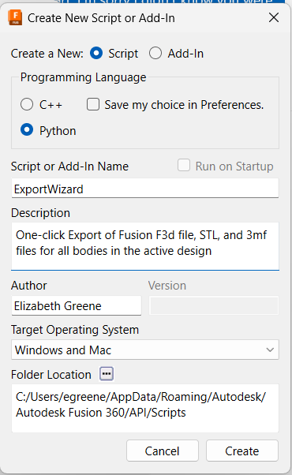

# Fusion360Addins\ExportWizard

This script Saves the .F3D and .Step files for a project and then loops through all the components to export the bodies as STLs and 3MFs.

## Installing

I don't understand the "right" way to install this script into fusion.
I install it like this

* Download ExportWizard.Py from GitHub and open it in notepad
* Open Fusion
* On the Utilities Tab, Click Add-Ins
* Click "Create"

* Name the Add-in "ExportWizard"
* Select Python as the language
* Optionally, fill out the Description and Author
* Click Create to return to the add-ins window
* Click on ExportWizard
* Click "Edit"
* Switch to the Notepad where you opened ExportWizard.Py from github
* In Notepad, Edit >> Select All >> Copy the contents of the file.
* Switch to the Notepad or other editor where Fusion opened the new exportWizard.py file
* Replace the contents of this file with the code from github.

## Suggestions for future work

* Please PLEASE fix that derpy install process.
* Add a progress indicator
* Add a UI with radio boxes to select what to export
* ... and optionally sort the output into folders based on file type
* ... and optionally to add the component name to the file names
* Add other exports, e.g. DWG/DXF, comments, etc?
* Add data to tell the user when a body has been renamed e.g.
* * Wireholder\1/4" Spool was saved as 14 Spool.stl/3mf because \/:*><|" are not allowed in
* * Wireholder\Body1 was saved as Body1(1) because multiple bodies are named Body1.